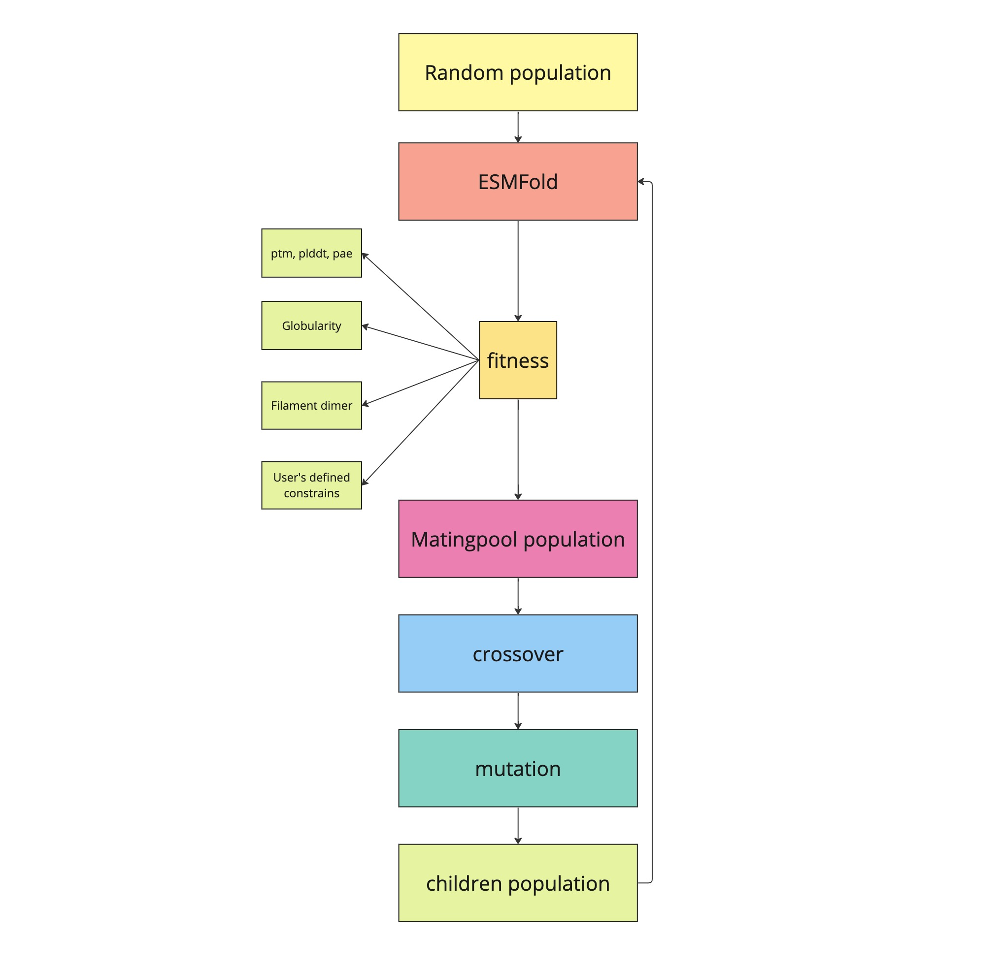

**In Silico Protein Evolution with Hallucination**

Numerous progress has been made in protein structure prediction through the application of deep neural networks. Models like ESM (Evolutionary Scale Modeling) and AlphaFold have demonstrated impressive capabilities in accurately predicting protein structures. ESM, as a language model trained on natural sequences only, exhibits faster feature prediction compared to models that consider both sequences and Multiple Sequence Alignments (MSA), such as AlphaFold.
Therefore, in here it has been attempted to examine ESM to see if its captured features can be employed to simulate sequence evolution and generate sequences distinct from natural ones. The method considers both amino acids and backbones in the protein generation process.

The simulation initiates with a population of randomly generated protein sequences, initially resulting in featureless predictions when subjected to the ESM model for structure prediction. Subsequently, a Genetic Algorithm is employed as an evolution algorithm to iteratively optimize the population towards desired structural constraints. This optimization process takes into account protein backbones and evaluates structural scores. Each sequence is assigned a fitness score, and sequences with high fitness scores are selected. The optimization steps involve applying crossover and mutation operations on the sequences.

Optimizing from randomly generated proteins with a 20\% dissimilarity in residues yields a population with high mean pLDDT scores. This emphasizes that the ESM model, initially trained on natural proteins, can effectively hallucinate sequences and their backbones with high confidence. This suggests a promising potential for utilizing the model in generating de novo proteins that differ significantly from natural ones.

 

  

