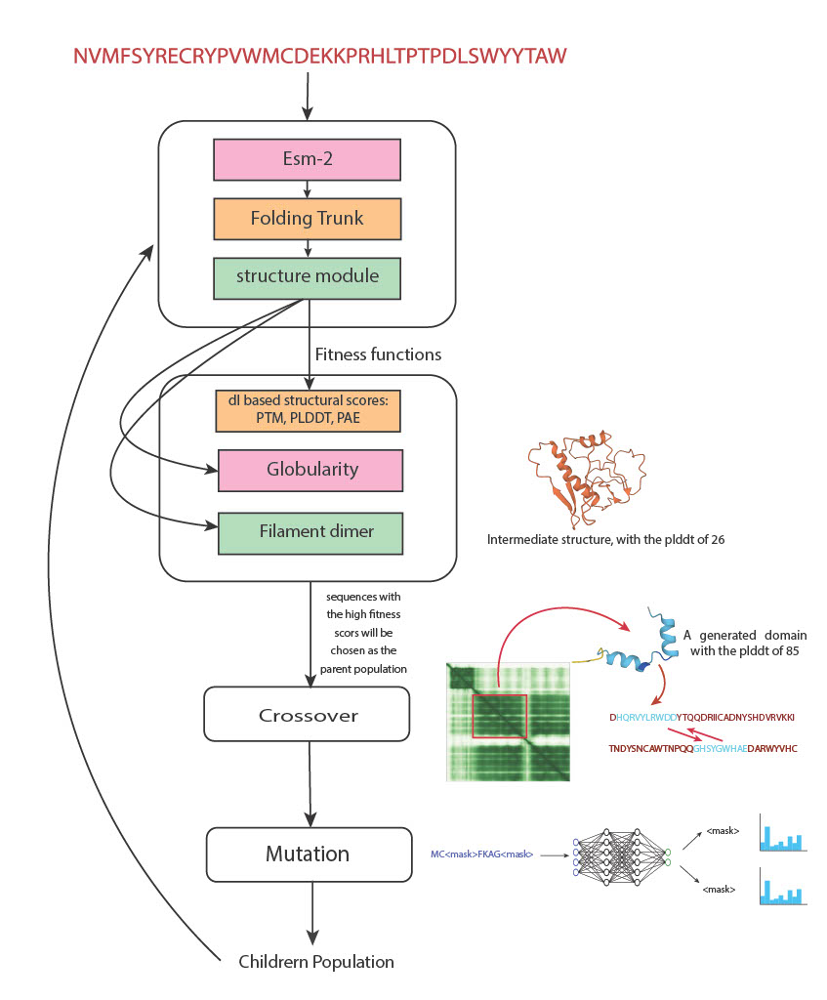

**In Silico Protein Evolution with Hallucination**

Recent advances in protein structure prediction, driven by deep neural networks, have revolutionized computational biology. Notably, models such as AlphaFold and ESM (Evolutionary Scale Modeling) have demonstrated extraordinary capabilities. AlphaFold, which integrates both sequence and Multiple Sequence Alignments (MSA) information, provides detailed insights into protein folding with high accuracy. In contrast, ESM, a transformer-based language model trained solely on natural protein sequences, excels in speed and efficiency while predicting protein features. The advent of ESMFold further empowers the ESM framework by combining protein language modeling with structural prediction capabilities.
This project explores the capacity of ESM and ESMFold to simulate protein sequence evolution, focusing on generating synthetic sequences distinct from natural ones. By leveraging the ESMFold model for structure prediction and employing a Genetic Algorithm (GA) for optimization, this approach seeks to hallucinate protein sequences that meet predefined structural constraints, emphasizing backbone generation and amino acid substitution.


**Overview of the Methodology**
The simulation begins with an initial population of randomly generated protein sequences, which, when passed through ESMFold, lack significant structural features. A Genetic Algorithm is then employed to optimize this population iteratively.

**Step-by-Step Process**

###Initialization:
Start with a randomly generated population of protein sequences.
Use ESMFold to predict the structure and assess initial structural properties (e.g., pLDDT scores).

###Fitness Evaluation:
Assign a fitness score to each sequence based on how well its structure aligns with the desired constraints.
Structural fitness is evaluated using metrics like pLDDT scores and backbone accuracy.

###Selection:
Identify high-fitness sequences as parent populations for the next generation.

###Crossover:
Exchange domains between parent sequences to generate a new set of offspring (children population).

###Mutation:
Substitute up to 5% of the amino acids in the offspring using ESM model logits.
Mask amino acids with lower pLDDT scores and replace them with higher-confidence predictions from the ESM model.

###Iteration:
Combine the parent population with the newly generated sequences and repeat the process.
Iteratively optimize the population towards sequences with high pLDDT scores and structural integrity (e.g., filament dimer shapes).

The algorithm progressively evolves the sequence population, starting with 20% residue dissimilarity, to produce high-confidence proteins with distinct backbones. This showcases the potential of ESMFold in generating de novo proteins that are markedly different from natural ones, while maintaining structural feasibility.


<br>

<p align="center">
  
</p>


### Getting started
Firstly, PyTorch must have been installed.
Secondly, to work with ESM and ESMFold, make sure to to have an environment with python <= 3.9 then follow the below installations:

```bash
pip install fair-esm  # latest release, OR:
pip install git+https://github.com/facebookresearch/esm.git  # bleeding edge, current repo main branch
```

```bash
pip install "fair-esm[esmfold]"
# OpenFold and its remaining dependency
pip install 'dllogger @ git+https://github.com/NVIDIA/dllogger.git'
pip install 'openfold @ git+https://github.com/aqlaboratory/openfold.git@4b41059694619831a7db195b7e0988fc4ff3a307'
```

**NOTE**: check that `nvcc` is available and that a cuda-compatable version of PyTorch has been installed.

To generate the protein population with the desired properties, (number of steps = 100 iterations, sequence length = 200, population size = 50, number of chains in a sequence = 2, path to load the ems model, path to save the generated population); here is an example command to run the script with sample arguments:
```bash
python3 Evolution.py 100 200 50 2 /path/to/save/model /path/to/output/population
```
